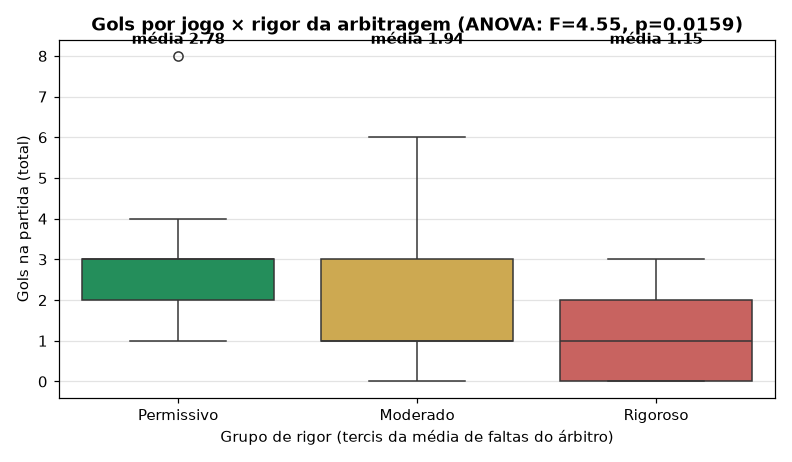
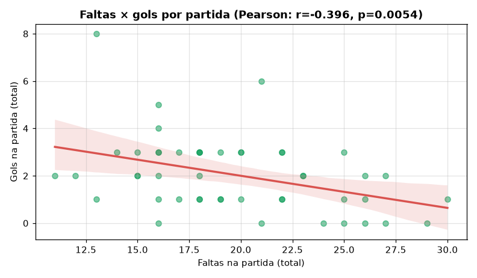
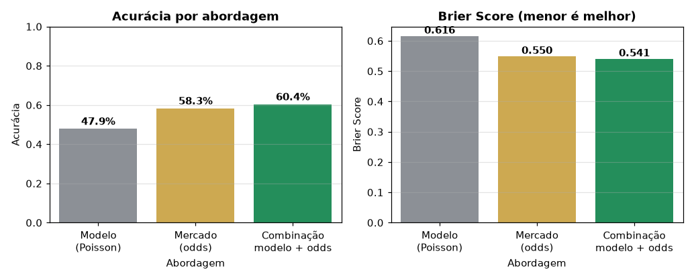

# ⚽ Libertadores 2026 - Previsão de Resultados

[](https://python.org)
[](https://pandas.pydata.org/)
[](https://scikit-learn.org/)
[](app.py)
[](LICENSE)

---

## 🎯 Objetivo do Projeto

Este projeto tem como objetivo **prever os resultados dos jogos da Copa Libertadores da América de 2026** utilizando dados estatísticos e históricos. O foco principal está nas **quartas de final**, mas a metodologia pode ser aplicada a qualquer fase do torneio.

O projeto foi desenvolvido como parte do meu portfólio para demonstrar habilidades em:
- Coleta e limpeza de dados esportivos
- Análise exploratória (EDA)
- Engenharia de features
- Modelagem preditiva (Classificação e Regressão)
- Documentação e boas práticas de Ciência de Dados

---

## 📊 Dados Utilizados

### Fonte dos Dados (100% reais — nenhum dado simulado)

- [openfootball/south-america](https://github.com/openfootball/south-america) (domínio público) —
  **todas as partidas da Copa Libertadores 2012–2026** (classificatórias, fase de grupos e
  mata-mata), versionadas em `data/historical/openfootball/`
- [ESPN](https://site.api.espn.com/apis/site/v2/sports/soccer/conmebol.libertadores/scoreboard) —
  placares recentes (playoffs de agosto/2026) e conferência cruzada
- [FBref](https://fbref.com/en/comps/14/stats/Copa-Libertadores-Stats) —
  **elencos e jogadores** (gols, assistências, finalizações, desarmes ganhos,
  interceptações, faltas) via [`src/fbref_scraper.py`](src/fbref_scraper.py);
  snapshot auditável em `data/historical/fbref/`. Calendário do mata-mata
  2026 em `data/historical/fbref_mata_mata_2026.md`
- [Bzzoiro Sports Data](https://sports.bzzoiro.com/) – **Odds 1X2** (consenso multi-bookmaker; requer chave)
- [API Futebol](https://www.api-futebol.com.br/) – **Estatísticas detalhadas** (faltas, cartões, posse, passes, finalizações) e **arbitragem** (requer chave)

O dataset consolidado é **`data/historical/partidas_libertadores.csv`** (2.227 partidas,
2.226 com placar, 15 edições), reconstruído com validação de integridade
(`sum(GP) == sum(GC)` por tabela, duplicatas, pernas dos confrontos):

    python src/real_data.py build      # reconstrói e valida o dataset
    python src/real_data.py tabelas    # gera data/raw/*.csv do dashboard
    python src/real_data.py validate   # roda só a validação
    python src/fbref_scraper.py scrape --season 2026   # elencos/jogadores FBref

**Sem chaves de API, nenhuma base sintética é usada**: as páginas de arbitragem/odds
exigem `API_FUTEBOL_KEY`/`BSD_API` (ou `ALLOW_EXAMPLE_DATA=1` explícito, só para desenvolvimento).

### Dados Atuais (Libertadores 2026 — reais, atualizados em 21/08/2026)
- **Fase de Grupos**: 32 times, 8 grupos (A–H), tabela **derivada das partidas**
  (consistência `GP == GC` garantida por construção).
- **Oitavas de Final (Round of 16)**: ida e volta completas — classificados:
  Fluminense (pên. 5–4), Estudiantes (4–1), Platense (pên. 7–6), Palmeiras (2–1),
  Flamengo (3–2), LDU (pên. 5–4) e Corinthians (1–0); Tolima × Independiente del Valle
  decide a última vaga em 25/08 (ida remarcada: 0–1).
- **Quartas de Final (reais, ida em 09/09 e volta em 16/09)**:
  Fluminense × Platense · Estudiantes × Corinthians · Palmeiras × LDU ·
  Flamengo × (Tolima ou IDV).
- **Histórico completo**: edições 2012–2025 com todos os mata-matas
  (campeões conferidos contra a realidade: 2019 Flamengo, 2020 Palmeiras, 2021 Palmeiras, 2022 Flamengo…).

### Estrutura dos Dados
```
data/
├── raw/
│   ├── grupos_libertadores_2026.csv
│   ├── oitavas_resultados.csv
│   ├── confrontos_quartas.csv
│   ├── partidas_estatisticas_<id>.json   # cache da API Futebol
│   └── odds_<event_id>.json              # cache da Bzzoiro
├── historical/fbref/
│   ├── elencos_2026.csv           # Snapshot real (32 times, 22/08/2026)
│   └── PROVENIENCIA.md
├── processed/
│   ├── features_libertadores.csv                  # Dados com engenharia de features
│   ├── fbref_elencos.csv / fbref_jogadores.csv    # Saída da raspagem FBref
│   ├── fbref_libertadores.sqlite                  # temporada → time → jogador
│   ├── analise_elencos.csv / forma_recente.csv     # Índices de elenco + últimos 5 jogos
│   ├── analise_confrontos_elenco.csv              # Quartas com/sem ajuste de elenco
│   ├── libertadores_estatisticas_detalhadas.csv   # Estatísticas por partida (API Futebol)
│   └── libertadores_odds.csv                      # Odds 1X2 processadas (Bzzoiro)
├── examples/          # Bases de exemplo (versionadas — fallback sem API)
│   ├── partidas_libertadores_2026.csv
│   └── odds_libertadores_2026.csv
└── external/
    └── elo_rankings.csv            # Ranking Elo dos times (futuro)
```

---

## 📈 Dados de Odds e Arbitragem

Esta seção documenta as duas novas fontes de dados integradas ao projeto e a
metodologia de análise que as utiliza.

### Fontes

| Fonte | O que fornece | Módulo | Produto final |
|-------|---------------|--------|---------------|
| [Bzzoiro Sports Data](https://sports.bzzoiro.com/docs) | Odds decimais 1X2 (consenso multi-bookmaker) | [`src/odds_client.py`](src/odds_client.py) | `data/processed/libertadores_odds.csv` |
| [API Futebol](https://www.api-futebol.com.br/) | Faltas, cartões, posse, passes, finalizações, escanteios, impedimentos, defesas e árbitro | [`src/api_futebol_client.py`](src/api_futebol_client.py) | `data/processed/libertadores_estatisticas_detalhadas.csv` |
| [FBref](https://fbref.com/en/comps/14/stats/Copa-Libertadores-Stats) | Elencos e jogadores (Standard, Shooting, Misc, Playing Time, Keepers) | [`src/fbref_scraper.py`](src/fbref_scraper.py) | `data/processed/fbref_*.csv` + SQLite |

**Colunas do CSV de estatísticas (por partida):** `partida_id`, `data`, `fase`,
`rodada`, `grupo`, `mandante`, `visitante`, `gols_mandante`, `gols_visitante`,
`resultado`, `arbitro`, `arbitro_pais`, `faltas_*`, `cartoes_amarelos_*`,
`cartoes_vermelhos_*`, `posse_*`, `passes_certos_*`, `passes_errados_*`,
`finalizacoes_*`, `finalizacoes_no_gol_*`, `finalizacoes_fora_*`,
`escanteios_*`, `impedimentos_*`, `defesas_*` (sempre por `mandante`/`visitante`).

**Colunas do CSV de odds:** `odd_mandante`, `odd_empate`, `odd_visitante`,
`prob_mandante_impl`, `prob_empate_impl`, `prob_visitante_impl` (implícitas =
1/odd, normalizadas para remover a margem da casa), `margem`, `bookmaker` e o
resultado real de cada partida.

### Configuração das Chaves de API

1. **Localmente** — copie o arquivo de exemplo e preencha as chaves:
   ```bash
   cp .env.example .env
   # edite o .env:
   #   BSD_API=sua_chave_bzzoiro
   #   API_FUTEBOL_KEY=sua_chave_api_futebol
   ```
   O `.env` é carregado automaticamente por `python-dotenv` e **nunca deve ser
   commitado** (já está no `.gitignore`).

2. **No GitHub** — adicione as mesmas variáveis em
   *Settings → Secrets and variables → Actions → New repository secret*:
   | Secret | Usada por |
   |--------|-----------|
   | `BSD_API` | `src/odds_client.py` e o workflow `.github/workflows/update_data.yml` |
   | `API_FUTEBOL_KEY` | `src/api_futebol_client.py` e o workflow de atualização diária |

   - **Bzzoiro**: registre-se em [sports.bzzoiro.com/register](https://sports.bzzoiro.com/register/)
     e copie a chave (o plano gratuito retorna o consenso multi-bookmaker).
     Documentação: [sports.bzzoiro.com/docs](https://sports.bzzoiro.com/docs).
   - **API Futebol**: crie uma conta em [api-futebol.com.br](https://www.api-futebol.com.br/)
     e gere a chave no painel. Documentação:
     [api-futebol.com.br/documentacao](https://www.api-futebol.com.br/documentacao).

### Rate Limits e Fallback

- A **API Futebol** limita a **10 requisições/minuto**. O cliente implementa
  `time.sleep(6)` entre chamadas, retries com backoff exponencial e **cache em
  disco** (`data/raw/partidas_estatisticas_<id>.json`), para nunca repetir uma
  chamada desnecessariamente.
- A **Bzzoiro** trata rate limit (HTTP 429 com `Retry-After`) e erros de
  conexão; as respostas de odds são cacheadas por 6 horas
  (`data/raw/odds_<event_id>.json`).
- **Sem chave, sem internet ou diante de falhas persistentes**, o pipeline
  **não quebra**: os clientes usam as bases de exemplo de `data/examples/`
  (geradas deterministicamente por
  [`src/generate_example_data.py`](src/generate_example_data.py)), e o
  dashboard/notebook funcionam normalmente. A cobertura real (quais jogos têm
  odds e estatísticas e quais não têm) é reportada na saída do pipeline.

### Metodologia de Análise

**Arbitragem** (ver [`notebooks/05_analise_arbitragem_odds.ipynb`](notebooks/05_analise_arbitragem_odds.ipynb)):

1. **Perfil do árbitro** — média por jogo de faltas, cartões (amarelos e
   vermelhos) e gols;
2. **Grupos de rigor** — partidas agrupadas em tercis pela média de faltas do
   árbitro (`Permissivo`, `Moderado`, `Rigoroso`);
3. **ANOVA de uma via** — testa se a média de gols difere entre os grupos de
   rigor (H₀: médias iguais);
4. **Correlação de Pearson** — entre faltas × gols, cartões × gols e posse ×
   gols (por partida), e entre faltas do time e aproveitamento de pontos.

**Odds × modelo**:

1. **Probabilidades implícitas** — `1/odd` por resultado, normalizadas para
   somar 100% (remove a margem/overround da casa);
2. **Comparação** — dispersão `P(modelo)` × `P(mercado)` por partida;
3. **Métricas** — **acurácia** (a classe mais provável acertou o resultado?) e
   **Brier Score** multiclasse (menor é melhor);
4. **Combinação inteligente** — quando o mercado diverge fortemente do modelo
   (`|ΔP| > limiar`, padrão 8 p.p.), usa-se a odd (o mercado é tratado como
   portador de informação extra — lesões, escalações); caso contrário, usa-se
   o modelo. O limiar é ajustável no dashboard.

### Insights Gerados (base de exemplo atual)

> Os números abaixo vêm da base de exemplo de `data/examples/` (48 partidas,
> gerada deterministicamente — os efeitos da arbitragem são amplificados nela
> para fins de ilustração metodológica).

- **Arbitragem influencia os gols.** A ANOVA mostra diferença significativa
  entre os grupos de rigor (F = 4.55, **p = 0.016**): jogos de árbitros
  **permissivos têm em média 2.78 gols**, contra **1.15 dos rigorosos**
  (média da competição: 2.04). A correlação faltas × gols é negativa e
  significativa (r = -0.40, p = 0.005).
  *Ex.: Wilmar Roldán apita jogos com 15.4 faltas em média (vs. 19.7 da
  competição) e 2.60 gols/jogo; Piero Maza, 24.9 faltas e 1.29 gols/jogo —
  indício de que árbitros mais permissivos geram jogos com mais gols.*
- **As odds melhoram o modelo.** O mercado (acurácia **58.3%**) supera o
  modelo de Poisson puro (**47.9%**). A combinação inteligente modelo + odds
  atinge **60.4%** de acurácia — **+12.5 p.p.** sobre o modelo puro — e o
  menor Brier Score (**0.541** vs. 0.616 do modelo e 0.550 do mercado).
- **Agressividade × aproveitamento.** Times que cometem mais faltas têm, nesta
  amostra, aproveitamento **menor** (r = -0.50 entre faltas do time e % de
  pontos conquistados); cartões × gols não mostrou correlação significativa.

### Gráficos de Exemplo

<p align="center">
  
  
</p>
<p align="center">
  
</p>

Os gráficos são gerados a partir das funções de análise de
[`src/preprocessing.py`](src/preprocessing.py) e reproduzidos interativamente
nas páginas do dashboard.

---

## 🔍 Análise Exploratória (Insights Iniciais)

Com base nos dados da fase de grupos e oitavas, já podemos extrair insights importantes:

### 📈 Desempenho dos Times na Fase de Grupos
- **Melhor campanha**: **Flamengo** (BRA) – 16 pontos, saldo +12, 5 vitórias.
- **Melhor ataque**: **Independiente Rivadavia** (ARG) – 15 gols em 6 jogos.
- **Melhor defesa**: **Flamengo** (BRA) – apenas 2 gols sofridos.
- **Média de gols por jogo**: **2.4** gols/partida.

### 🏆 Oitavas de Final – Destaques
- **Brasil domina**: 4 times brasileiros nas quartas (Flamengo, Palmeiras, Corinthians, Fluminense).
- **Disputas equilibradas**: 3 confrontos foram decididos nos pênaltis (Fluminense, Platense, LDU).
- **Flamengo eliminou o Cruzeiro** em um confronto brasileiro com placar agregado de 3x2.

### 📊 Gráficos (a serem gerados)
- Distribuição de gols por time.
- Comparação de ataques e defesas.
- Probabilidade de classificação por país.

---

## ⚙️ Metodologia de Previsão

### Abordagem em 3 Camadas

1. **Dados Históricos (Força Bruta)**
   - O classificador **XGBoost** é treinado com **todas as edições históricas 2012–2026** (`data/historical/partidas_libertadores.csv`, 2.226 partidas).
   - Features causais: **Elo por time**, **médias móveis de gols com shrinkage**, indicadores de **mesmo país** e de **fase mata-mata** — todas extraídas do estado anterior a cada partida (**sem vazamento**, sem *lookahead*).

2. **Contexto Atual (2026)**
   - Utilização dos dados da fase de grupos e oitavas para capturar o momento atual de cada time.
   - Features: pontuação, saldo de gols, aproveitamento em casa/fora.

3. **Ranking Elo (Fator Curinga)**
   - Cálculo do **Elo Rating** de cada time com base nos últimos 10 jogos oficiais (nacionais e internacionais).
   - Isso captura a *fase real* do time, independentemente do histórico antigo.

### Modelos Utilizados

| Tarefa | Modelo | Bibliotecas |
|--------|--------|-------------|
| Prever resultado (V/E/D) | **XGBoost Classifier** | `xgboost`, `sklearn` |
| Prever placar exato e probabilidades 1X2 | **Regressão de Poisson** | `scipy` |
| Avaliar importância das features | **Feature Importance** | `matplotlib`, `seaborn` |

### Modelo de Regressão de Poisson (Placares)

O placar de uma partida é modelado assumindo que o número de gols de cada time
segue uma **distribuição de Poisson** cuja taxa depende da força de ataque do
time e da fragilidade defensiva do adversário, ajustada pelo mando de campo:

```
lambda_casa = ataque_casa * defesa_fora * vantagem_casa / media_liga
lambda_fora = ataque_fora * defesa_casa * fator_fora     / media_liga
```

Onde:

- `ataque_i` = gols marcados por jogo do time `i` (`GP / J`);
- `defesa_j` = gols sofridos por jogo do time `j` (`GC / J`);
- `media_liga` = média de gols por jogo da competição;
- `vantagem_casa` (1.15) e `fator_fora` (0.85) modelam o efeito de jogar em casa.

Com os lambdas estimados, a probabilidade de cada placar `(i x j)` é o produto
das probabilidades marginais (`Poisson(i; lambda_casa) * Poisson(j; lambda_fora)`),
e a partir da matriz de placares derivam-se as probabilidades 1X2 e o placar mais
provável. A implementação está em [`src/poisson.py`](src/poisson.py).

> Referências conceituais: Maher (1982) e Dixon & Coles (1997), na forma
> multiplicativa simplificada aplicável a estatísticas agregadas da fase de grupos.

### Ajuste por análise de elenco

Depois do `fit` clássico, [`src/elenco_analysis.py`](src/elenco_analysis.py)
multiplica ataque e defesa por índices reais:

| Sinal | Fonte | Efeito no Poisson |
|-------|-------|-------------------|
| Poder de fogo | 0.4·gols/90 + 0.3·assist/90 + 0.2·SoT/90 + 0.1·chutes/90 | sobe/desce `ataque` |
| Pressão defensiva | (desarmes ganhos + interceptações) / 90 | reduz `defesa` (gols sofridos) |
| Química | `11 / n_jogadores` (proxy de repetição de XI) | leve bônus de organização |
| Disciplina | cartões + faltas / 90 | time sujo sofre um pouco mais |
| Forma recente | últimos 5 jogos (openfootball) | mistura 20% na taxa observada |

O CSV `outputs/quartas_previsao.csv` guarda o cenário-base e o cenário com
elenco (`Prob_*_base`, `Delta_xG_*`, `Nota_Elenco`).

### Métricas de Avaliação
- **Acurácia** e **log_loss** do classificador medidos em **holdout out-of-sample**: split temporal com os **últimos 20%** das partidas como conjunto de teste. Resultados medidos: **acurácia ≈ 49,3%** e **log_loss ≈ 1,056**.
  - Nota honesta: previsão 1X2 no futebol costuma ter um teto prático próximo da acurácia de mercado (~58%); os números acima refletem a dificuldade real da tarefa, não um defeito de validação.
- **Erro Absoluto Médio (MAE)** para previsão de gols.
- **Backtesting** com os dados das oitavas de final (validação histórica).

---

## 📈 Previsões para as Quartas de Final (09/09)

Com base nos dados atuais e na análise estatística preliminar, as probabilidades para os confrontos são:

| Jogo | Mandante | Visitante | Prob. Mandante | Prob. Empate | Prob. Visitante | Placar Mais Provável |
|------|----------|-----------|----------------|--------------|-----------------|----------------------|
| QF1 | Estudiantes (ARG) | Corinthians (BRA) | 27% | 37% | **36%** | 0x0 |
| QF2 | Palmeiras (BRA) | LDU (ECU) | **50%** | 28% | 22% | 1x0 |
| QF3 | Flamengo (BRA) | Tolima ou IDV | — | — | — | a definir (volta em 25/08) |
| QF4 | Fluminense (BRA) | Platense (ARG) | **41%** | 27% | 32% | 1x1 |

*Previsões do Poisson da fase de grupos **ajustado pelos índices de elenco**
(FBref + forma recente). QF3 aguarda o vencedor de Tolima × Independiente
del Valle (25/08). Rode `python src/predict.py` para o CSV com cenário-base
e cenário-elenco lado a lado.*

A aba **🏆 Mata-mata até o título** do dashboard mostra o chaveamento completo em
cards por fase (quartas reais → semis e final previstas → **campeão previsto com
% de título**), calculando confrontos de ida e volta por convolução das matrizes
de Poisson (pênaltis 50/50) e a final em campo neutro. O caminho é calculado
respeitando o chaveamento oficial: **QF1 × QF2** e **QF3 × QF4** nas semifinais.*

> ⚠️ **Observação**: Estas previsões são baseadas em dados estatísticos e não consideram fatores imprevistos como lesões, suspensões ou mudanças táticas de última hora. O modelo será atualizado conforme novos dados forem disponibilizados.

---

## 🛠️ Como Executar o Projeto

### Pré-requisitos
- Python 3.9 ou superior
- Pip (gerenciador de pacotes)

### Passos

1. **Clone o repositório**
   ```bash
   git clone https://github.com/alexsantossp71-lgtm/libertadores2026.git
   cd libertadores2026
   ```

2. **Crie um ambiente virtual** (opcional, mas recomendado)
   ```bash
   python -m venv venv
   source venv/bin/activate   # Linux/Mac
   venv\Scripts\activate      # Windows
   ```

3. **Instale as dependências e o pacote**
   ```bash
   pip install -r requirements.txt
   pip install -e .   # torna o pacote `src` importável (app, páginas, testes)
   ```

4. **Configure as chaves de API (opcional)**
   ```bash
   cp .env.example .env
   # preencha BSD_API e API_FUTEBOL_KEY — sem elas, o projeto usa
   # as bases de exemplo de data/examples/ (tudo continua funcionando)
   ```

5. **Execute o pipeline completo**
   ```bash
   python src/pipeline.py
   ```
   Isso irá:
   - Baixar os dados atualizados (scraper + FBref + API Futebol + Bzzoiro, se configurado)
   - Raspar elencos e jogadores da FBref (com fallback para o snapshot histórico)
   - Coletar estatísticas detalhadas (faltas, cartões, posse, passes,
     finalizações e arbitragem) — com o rate limit de 10 req/min respeitado
   - Coletar as odds 1X2 e calcular as probabilidades implícitas
   - Processar e limpar os dados
   - Treinar o modelo
   - Gerar as previsões para as quartas
   - Salvar os resultados em `outputs/`

   > Flags úteis: `--skip-scraping`, `--skip-fbref`, `--skip-training`,
   > `--skip-stats`, `--skip-odds`.

6. **Abra o dashboard interativo (Streamlit)**
   ```bash
   streamlit run app.py
   ```
   O app abre em `http://localhost:8501` e oferece:
   - 📊 **Visão geral**: tabela da fase de grupos e gráfico Ataque × Defesa;
   - 🔮 **Quartas de final**: probabilidades 1X2, gols esperados e placar mais
     provável de cada confronto, com exportação em CSV;
   - ⚔️ **Simulador**: escolha qualquer mandante × visitante e veja a matriz de
     placares, placares mais prováveis e mercados derivados (over/under,
     ambos marcam, clean sheet);
   - 🎲 **Monte Carlo**: simulação do mata-mata (quartas → título) com jogos de
     ida e volta e disputa de pênaltis;
   - 🟨 **Arbitragem e Estatísticas** (`pages/5_Arbitragem.py`): perfil por
     árbitro, top 10 por faltas, dispersão faltas × gols, boxplot de cartões
     (com filtro por país), radar de comparação entre dois árbitros, testes
     estatísticos (ANOVA e Pearson) e tabela ordenável;
   - 📊 **Odds e Probabilidades de Mercado** (`pages/6_Odds.py`): comparação
     modelo × odds lado a lado, indicador de quem acertou nas divergências,
     gráfico de diferença por partida, combinação inteligente modelo + odds
     (com limiar ajustável) e métricas de acurácia/Brier Score;
   - ⚙️ **Parâmetros ao vivo**: vantagem de mando de campo e truncamento da
     Poisson ajustáveis na barra lateral.

   > Se os CSVs de `data/raw/` não existirem, o app executa o scraper
   > automaticamente para gerar a base de exemplo.

7. **Explore os notebooks**
   ```bash
   jupyter notebook notebooks/
   ```
   Abra `01_eda_libertadores.ipynb` (análise exploratória),
   `02_feature_engineering.ipynb` (features),
   `03_fbref_elencos.ipynb` (índices de elenco da FBref) e
   `05_analise_arbitragem_odds.ipynb` (arbitragem e odds, já executado com os
   resultados).

8. **Execute os testes** (opcional)
   ```bash
   python -m pytest tests/ -v
   ```
   Valida o modelo de Poisson, a engenharia de features, os clientes de API
   (parsing e fallback offline) e a integração do pipeline.

---

## 📁 Estrutura do Repositório

```
libertadores2026/
├── app.py                 # 🖥️ Dashboard interativo (Streamlit)
├── pages/
│   ├── 5_Arbitragem.py    # 🟨 Análise de arbitragem e estatísticas
│   ├── 6_Odds.py          # 📊 Odds e probabilidades de mercado
│   └── 7_Elencos.py       # 👕 Análise de elencos (FBref + forma)
├── .streamlit/
│   └── config.toml        # Tema e configuração do dashboard
├── data/
│   ├── raw/               # Dados brutos (CSVs e caches JSON das APIs)
│   ├── processed/         # Dados limpos e com features
│   ├── examples/          # Bases de exemplo (fallback sem API)
│   └── external/          # Dados externos (rankings, etc.)
├── docs/
│   └── images/            # Gráficos de exemplo da documentação
├── notebooks/
│   ├── 01_eda_libertadores.ipynb          # Análise exploratória
│   ├── 02_feature_engineering.ipynb       # Criação de features
│   ├── 03_fbref_elencos.ipynb             # Elencos e índices FBref
│   └── 05_analise_arbitragem_odds.ipynb   # Arbitragem e odds (executado)
├── src/
│   ├── real_data.py           # ★ Dados reais 2012–2026 (parser openfootball + suplementos)
│   ├── scraper.py             # Materializa as tabelas do dashboard (dados reais)
│   ├── fbref_scraper.py       # Raspagem FBref (elencos/jogadores → CSV + SQLite)
│   ├── fbref_features.py      # Índices de força ofensiva / pressão defensiva
│   ├── elenco_analysis.py     # Análise de elenco + ajuste do Poisson
│   ├── api_futebol_client.py  # Cliente da API Futebol (estatísticas/arbitragem)
│   ├── odds_client.py         # Cliente de odds da Bzzoiro Sports Data
│   ├── generate_example_data.py  # Gerador determinístico das bases de exemplo
│   ├── preprocessing.py       # Limpeza, transformação e análises (ANOVA, Brier…)
│   ├── poisson.py             # Modelo de Poisson (placares e probabilidades 1X2)
│   ├── model.py               # Treino e avaliação dos modelos
│   ├── pipeline.py            # Orquestração do fluxo completo (6 etapas)
│   ├── predict.py             # Geração de previsões
│   └── dashboard_utils.py     # Utilitários compartilhados do dashboard
├── tests/
│   ├── test_poisson.py            # Testes do modelo de Poisson
│   ├── test_preprocessing.py      # Testes da engenharia de features
│   ├── test_model.py              # Testes de integração
│   ├── test_api_futebol_client.py # Testes do cliente da API Futebol
│   ├── test_odds_client.py        # Testes do cliente de odds
│   ├── test_fbref_scraper.py      # Testes do parser/fallback FBref
│   ├── test_elenco_analysis.py    # Testes da análise de elenco / Poisson
│   └── test_generate_example_data.py  # Testes do gerador de exemplo
├── models/                # Modelos treinados (gitignored, gerados localmente)
├── outputs/
│   ├── charts/                # Gráficos gerados
│   └── quartas_previsao.csv   # Gerado por src/predict.py (gitignored)
├── .env.example          # Modelo de variáveis de ambiente (BSD_API, API_FUTEBOL_KEY)
├── requirements.txt       # Dependências do projeto
├── .gitignore
└── README.md              # Este arquivo
```

---

## 🚀 Próximos Passos (Melhorias Futuras)

- [x] **Dashboard Interativo**: aplicativo **Streamlit** (`app.py`) com previsões, simulador de confrontos e Monte Carlo do mata-mata.
- [x] **Dados de Odds**: odds 1X2 da **Bzzoiro Sports Data** com probabilidades implícitas e comparação com o modelo (`pages/6_Odds.py`).
- [x] **Análise de Arbitragem**: estatísticas detalhadas da **API Futebol** (faltas, cartões, posse, passes, finalizações) com testes estatísticos (`pages/5_Arbitragem.py`).
- [ ] **Automação**: workflow do GitHub Actions executando o pipeline diariamente com commit automático (ainda não criado).
- [x] **Estatísticas de elencos/jogadores (FBref)**: raspagem educada + snapshot real 2026 + índices de força ofensiva / pressão defensiva (`src/fbref_scraper.py`, `src/fbref_features.py`).
- [ ] **Passing network / heatmap**: exige evento por partida (StatsBomb/Sofascore) — a FBref da Libertadores não publica isso.
- [ ] **Modelo de Redes Neurais**: Experimentar LSTM para séries temporais de desempenho.
- [ ] **Validação out-of-sample**: calibrar o limiar da combinação modelo + odds com dados reais de edições anteriores.

---

## 📚 Sobre o Autor

**Alex Santos**  
Engenheiro de Computação | Cientista de Dados em formação  

Apaixonado por esportes e análise de dados, busco unir minha formação técnica com a capacidade de extrair insights valiosos de dados complexos. Este projeto é uma amostra do meu trabalho na área de Ciência de Dados aplicada a esportes.

- 🔗 [GitHub](https://github.com/alexsantossp71)
- 🔗 [LinkedIn](https://linkedin.com/in/alexsantossp71) *(adicione seu link)*
- 📧 alexsantossp71@gmail.com *(adicione seu email)*

---

## 📄 Licença

Este projeto está sob a licença MIT. Veja o arquivo [LICENSE](LICENSE) para mais detalhes.

---

⭐ **Se gostou deste projeto, deixe uma estrela no repositório!** Isso me ajuda a continuar desenvolvendo e compartilhando conhecimento.
